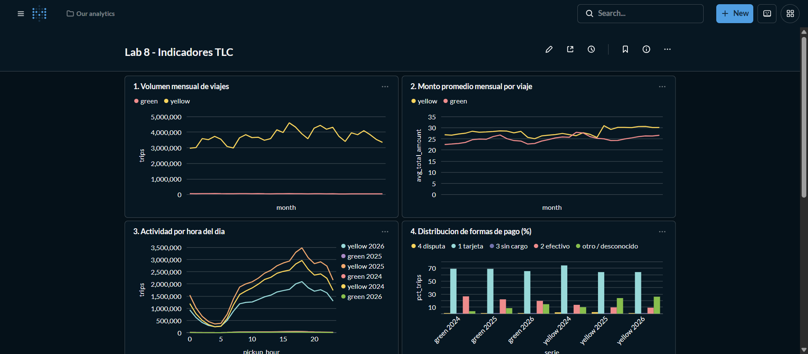
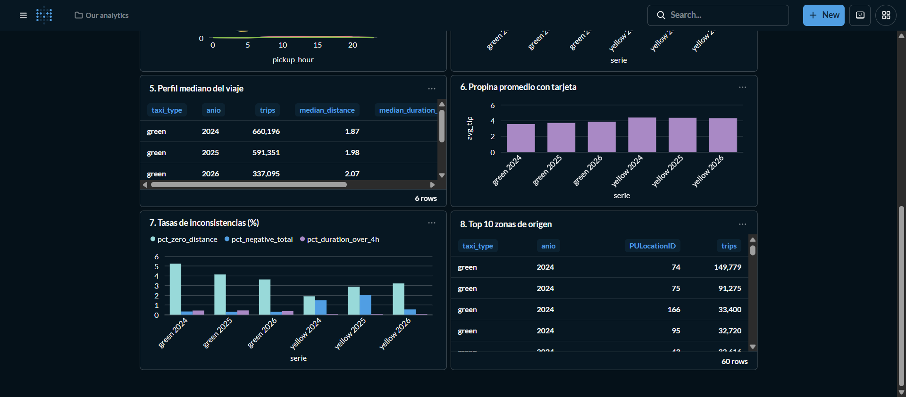

# Ejercicio 7 - Construccion de indicadores y visualizacion

El ejercicio 7 se resuelve con un conjunto reproducible de consultas e imagenes generadas desde DuckDB.

## Archivos asociados

- Consultas SQL: `sql/exercise7_indicators.sql`.
- Script generador: `scripts/generate_indicators.py`.
- Resultados y evidencia: `docs/exercise7_dashboard_results.md`.
- Figuras: `docs/figures/exercise7_*.png`.

## Como reproducir

Desde la raiz del proyecto, con el ambiente Docker activo:

```bash
docker compose exec lab python scripts/generate_indicators.py
```

El script lee los archivos Parquet disponibles en `data/raw/`, genera archivos CSV derivados en
`data/processed/indicators/` y guarda visualizaciones en `docs/figures/`.

## Tablero en Metabase

El tablero `Lab 8 - Indicadores TLC` se construye en Metabase (la herramienta proporcionada) con un
script reproducible que usa la API de Metabase:

```bash
docker compose exec lab python scripts/benchmark_parquet_vs_duckdb.py --force-materialize  # crea lab8.duckdb
docker compose exec lab python scripts/setup_metabase.py
```

El script:

1. crea el usuario administrador local si Metabase no esta configurado
   (`lab8@example.com` / `Lab8-DuckDB-2026`, modificables con `MB_EMAIL` y `MB_PASSWORD`);
2. registra la base `/workspace/data/processed/lab8.duckdb` con el driver DuckDB en modo
   `read_only`, para no bloquear el archivo a otros procesos;
3. crea 8 preguntas SQL nativas sobre la tabla `trips` (las mismas consultas de
   `sql/exercise7_indicators.sql`) y las organiza en el tablero. Si se ejecuta de nuevo, reemplaza
   el tablero y sus tarjetas.

La base no debe estar abierta en escritura (por ejemplo, durante el benchmark) mientras Metabase la
consulta. Al terminar, el script imprime la URL del tablero (`http://127.0.0.1:3000/dashboard/<id>`).

| tarjeta | visualizacion | pregunta |
|---|---|---|
| 1. Volumen mensual de viajes | linea | 1 y 2 |
| 2. Monto promedio mensual por viaje | linea | 4 |
| 3. Actividad por hora del dia | linea por tipo y anio | 3 |
| 4. Distribucion de formas de pago (%) | barras agrupadas | 6 |
| 5. Perfil mediano del viaje | tabla | 5 |
| 6. Propina promedio con tarjeta | barras | 7 |
| 7. Tasas de inconsistencias (%) | barras agrupadas | 8 y 9 |
| 8. Top 10 zonas de origen | tabla | 10 |

Evidencia del tablero con los datos 2024-2026:





En la tarjeta 1, la escala de yellow (3-4.6 M viajes por mes) hace ver plana la linea de green
(~50 mil); por eso las comparaciones entre servicios se hacen con porcentajes (tarjetas 4 y 7).

Las imagenes de `docs/figures/exercise7_*.png`, generadas por `scripts/generate_indicators.py`,
son una version estatica equivalente de los mismos indicadores.
