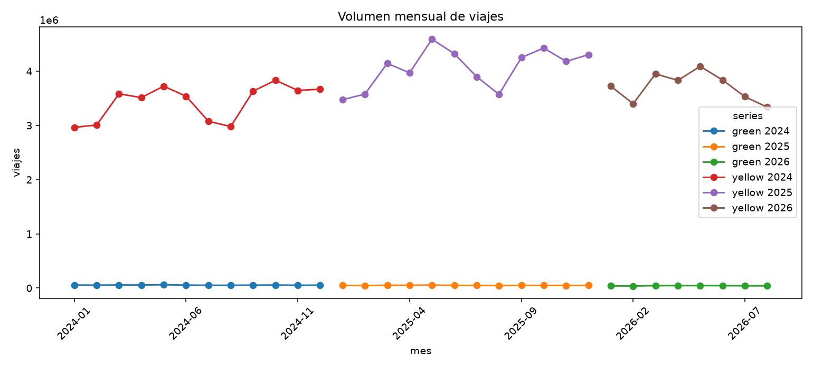
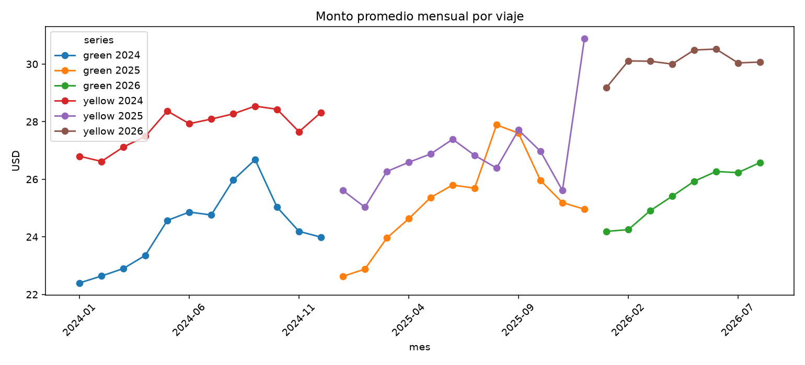
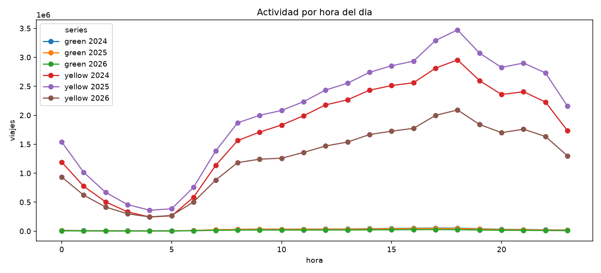
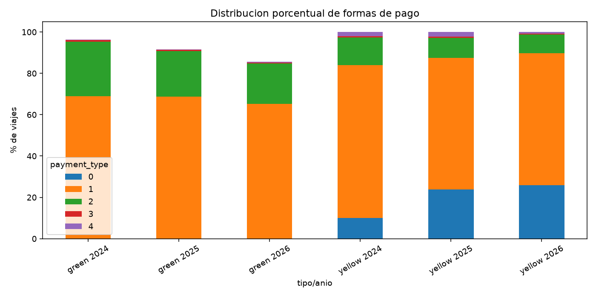
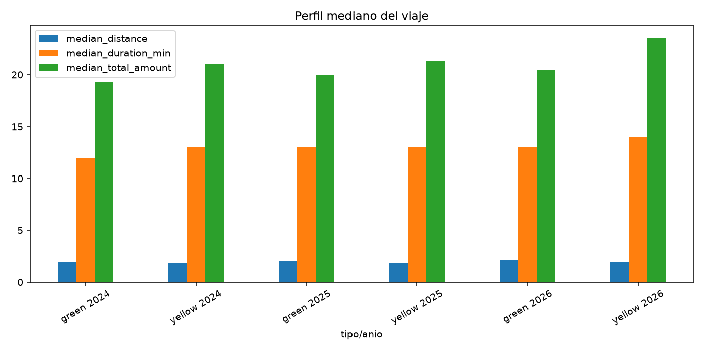
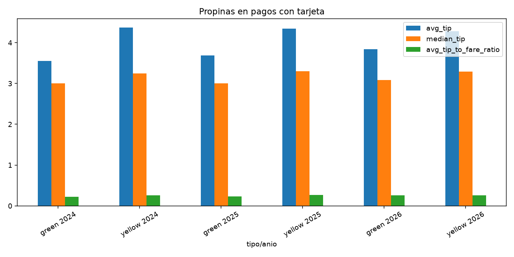
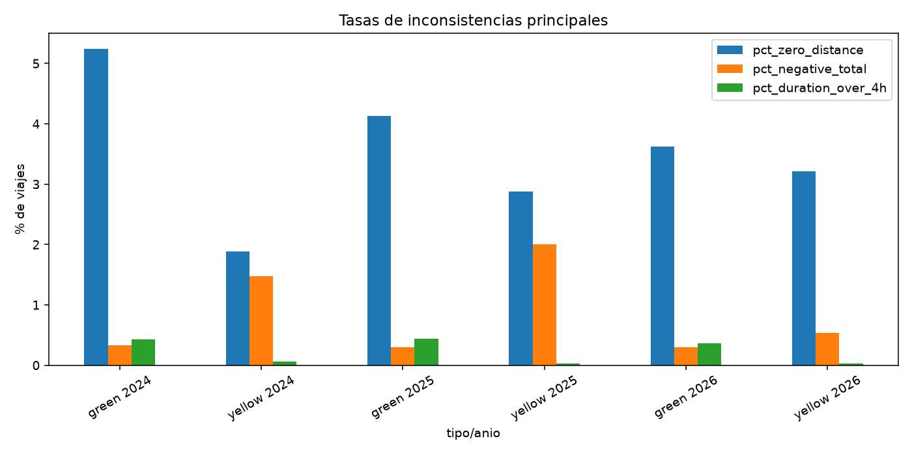

# Ejercicio 7 - Indicadores y visualizacion

Este documento resume los indicadores generados con `scripts/generate_indicators.py`.
Las consultas fuente estan documentadas en `sql/exercise7_indicators.sql`.

## Preguntas de analisis

1. Como cambia el volumen de viajes por mes y tipo de taxi?
2. Que tipo de taxi concentra mas viajes?
3. En que horas del dia hay mayor actividad?
4. Como cambia el monto promedio y mediano por mes?
5. Que tan diferente es el viaje tipico entre taxis amarillos y verdes?
6. Que metodos de pago predominan en cada tipo de taxi?
7. Como se comportan las propinas cuando el pago es con tarjeta?
8. Que porcentaje de viajes tiene distancia cero o montos negativos?
9. Que tan frecuentes son viajes extremadamente largos o caros?
10. Cuales son las zonas de origen con mayor volumen de viajes?

## Indicadores construidos

| indicador | pregunta que responde | visualizacion |
|---|---|---|
| Volumen mensual de viajes | 1 y 2 | linea temporal |
| Monto promedio mensual | 4 | linea temporal |
| Actividad por hora | 3 | linea por hora |
| Distribucion de pagos | 6 | barras apiladas |
| Perfil mediano del viaje | 5 | barras agrupadas |
| Propinas con tarjeta | 7 | barras agrupadas |
| Tasas de inconsistencias | 8 y 9 | barras agrupadas |
| Top zonas de origen | 10 | tabla |

## Visualizaciones generadas

## Resultados principales

El mayor volumen mensual observado fue para `yellow` en `2025-05`, con `4,591,844` viajes.
El metodo de pago mas frecuente por conteo fue `payment_type = 1` para `yellow` 2025.

### Perfil tipico de viajes

| taxi_type | file_year | trips | median_distance | median_duration_min | median_total_amount | avg_distance | avg_duration_min | avg_total_amount |
| --- | --- | --- | --- | --- | --- | --- | --- | --- |
| green | 2024 | 660196 | 1.87 | 12.0 | 19.32 | 17.02 | 19.63 | 24.26 |
| yellow | 2024 | 41168533 | 1.76 | 13.0 | 21.0 | 4.98 | 17.47 | 27.83 |
| green | 2025 | 591351 | 1.98 | 13.0 | 20.0 | 19.02 | 21.0 | 25.21 |
| yellow | 2025 | 48721089 | 1.85 | 13.0 | 21.35 | 6.84 | 17.36 | 26.91 |
| green | 2026 | 337095 | 2.07 | 13.0 | 20.46 | 13.35 | 20.78 | 25.49 |
| yellow | 2026 | 29703330 | 1.86 | 14.0 | 23.58 | 5.55 | 17.66 | 30.07 |

### Propinas en pagos con tarjeta

| taxi_type | file_year | card_trips | avg_tip | median_tip | avg_tip_to_fare_ratio |
| --- | --- | --- | --- | --- | --- |
| green | 2024 | 454545 | 3.55 | 3.0 | 0.223 |
| yellow | 2024 | 30451054 | 4.37 | 3.25 | 0.262 |
| green | 2025 | 406555 | 3.69 | 3.0 | 0.229 |
| yellow | 2025 | 31052479 | 4.34 | 3.3 | 0.265 |
| green | 2026 | 219837 | 3.84 | 3.08 | 0.256 |
| yellow | 2026 | 18937396 | 4.28 | 3.29 | 0.254 |

### Tasas de inconsistencias

| taxi_type | file_year | trips | pct_zero_distance | pct_negative_total | pct_negative_duration | pct_duration_over_4h | pct_distance_over_100_miles | pct_total_over_500 |
| --- | --- | --- | --- | --- | --- | --- | --- | --- |
| green | 2024 | 660198 | 5.24 | 0.33 | 0.0003 | 0.43 | 0.0356 | 0.0055 |
| yellow | 2024 | 41169664 | 1.89 | 1.48 | 0.0027 | 0.06 | 0.0039 | 0.002 |
| green | 2025 | 591354 | 4.13 | 0.3 | 0.0005 | 0.44 | 0.0353 | 0.0046 |
| yellow | 2025 | 48722573 | 2.88 | 2.0 | 0.003 | 0.03 | 0.0059 | 0.0025 |
| green | 2026 | 337100 | 3.62 | 0.3 | 0.0015 | 0.36 | 0.0214 | 0.0062 |
| yellow | 2026 | 29703338 | 3.21 | 0.54 | 0.0 | 0.03 | 0.0041 | 0.0027 |

## Interpretacion y hallazgos

1. Los taxis amarillos concentran mucho mas volumen que los verdes, por lo que el tablero separa siempre `taxi_type`.
2. La actividad horaria muestra mayor concentracion en la tarde y noche temprana, consistente con patrones urbanos de movilidad.
3. Los pagos con tarjeta dominan en ambos tipos de taxi y permiten analizar propinas de forma mas consistente.
4. La media y la mediana no siempre cuentan la misma historia; por eso el tablero usa medianas para describir el viaje tipico.
5. Existen inconsistencias como distancia cero, montos negativos y duraciones extremas. Estos indicadores deben monitorearse antes de usar los datos para decisiones finales.

## Evidencia del tablero

Las imagenes anteriores funcionan como evidencia reproducible del tablero generado desde DuckDB. Tambien pueden recrearse en Metabase usando las consultas de `sql/exercise7_indicators.sql` y la base `data/processed/lab8.duckdb` generada en el Ejercicio 6.
